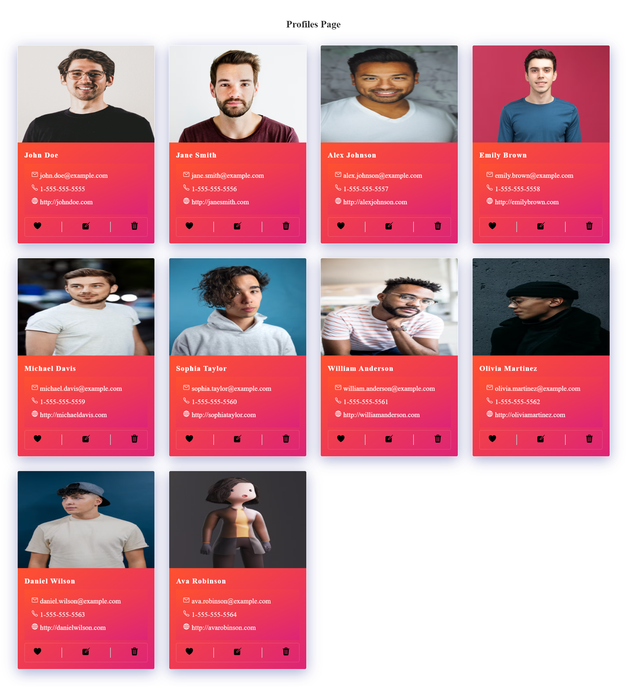

## React Js Developer Assignment

### Assignment

- We want applicants to create the closest possible replica of the "https://react-advanced-assignment.psamd.now.sh/".
- Take Mock JSON Data in any constant
- This app should be responsive (mobile, tablet and desktop) and will be tested on  Chrome browser.
- Only CSS, no css framework/library allowed

## Live Website
https://neenopal.netlify.app

## Github Link

https://github.com/Soham-0047/NeenOpal-Assignment.git

### Tech Stacks

- ReactJs + vite(for performance and storage)

- CSS5

- Icons from ionicon

### Images

### Vieo Link

https://youtu.be/-BYB6O0WETo

